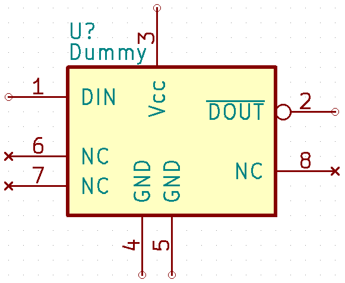
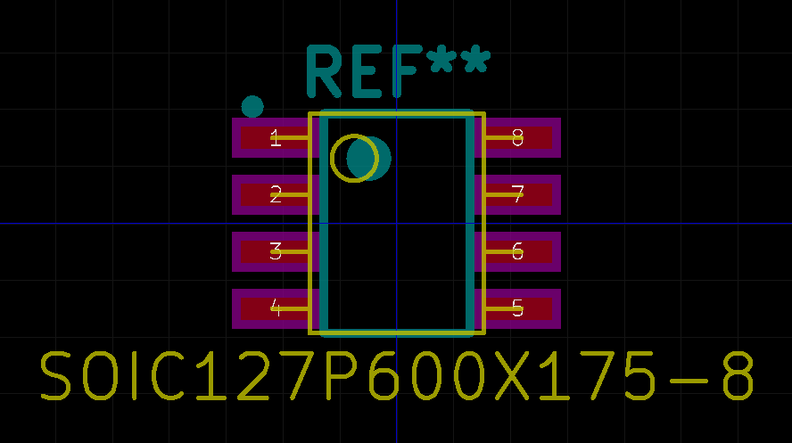

[](https://npmjs.org/package/qeda)
[](https://david-dm.org/qeda/qeda)
[](https://david-dm.org/qeda/qeda#info=devDependencies)

QEDA
====

QEDA is a Node.js library aimed to simplify creating libraries of electronic components for using in EDA software. You can easily create both symbols for schematic and land patterns for PCB.

Features
========

* Downloading component definitions from global repository
* Generating schematic symbols:
  - Single and multi part IC (dual-in-line, quad)
  - Connector
  - Capacitor, crystal, diode, FET, fuse, inductor, LED, pushbutton, resistor, switch, test point, transistor, TVS
  - Power supply, ground
  - GOST style alternative
* Borrowing packages dimensions from standards:
  - Industrial (JEDEC, JEITA)
  - Manufacturer's (NXP)
* Land pattern calculation according to IPC-7351 (tending to comply latest IPC-7351C):
  - Chip Array
  - Dual (CFP, DIP, SOIC, SOJ, SOL, SON, SOP)
  - Grid Array (BGA, CGA, LGA)
  - Mounting hole
  - Oscillator (corner concave, side concave, side flat)
  - Quad (CQFP, QFN, QFP)
  - Radial lead (Cylindrical)
  - SOT (SOT143, SOT223, SOT23, SOTFL)
  - Test point
  - TO (\*PAK)
  - Two Pin (Aluminum Electrolytic Capacitor, Chip, Crystal, Molded body, MELF, SOD, SODFL)
  - Custom element
* Generating libraries:
  - KiCad format
  - [coralEDA](http://repo.hu/projects/coraleda/) [pcb-rnb](http://repo.hu/projects/pcb-rnd/)
* 3D models generation

Installation
============

QEDA module for using in scripts as well as command line interface:

    npm install -g qeda

Examples
========

First example will download component descriptions from [library repository](https://github.com/qeda/library/) then save them to disk and add to library manager. Last string is to generate component library in KiCad format (schematic symbols for [Eeschema](http://kicad-pcb.org/discover/eeschema/) as well as PCB footprints for [PcbNew](http://kicad-pcb.org/discover/pcbnew/)).

CLI
---

Run in terminal (note that component names are case insensitive but power and ground nets are not):

```
qeda reset
qeda add altera/5m1270zt144
qeda add analog/ad9393
qeda add st/l3gd20h
qeda add ti/iso722
qeda power +5VDC
qeda power +3V3DC
qeda ground GNDDC
qeda ground signal/GNDS
qeda ground earth/GNDE
qeda ground chassis/GNDCH
qeda generate mylib
```
And find generated files in `./kicad` directory.

[Read more](http://qeda.org/doc/qeda/utility/) about available commands.

From script
-----------

Example is written on CoffeeScript but one can use vanilla JavaScript.

[script.coffee](./examples/script/script.coffee):

```coffeescript
Qeda = require 'qeda'

lib = new Qeda.Library
lib.add 'Altera/5M1270ZT144' # Add Altera MAX V CPLD
lib.add 'Analog/AD9393' # Add Analog Devices HDMI interface
lib.add 'ST/L3GD20H' # Add STMicroelectronics gyroscope
lib.add 'TI/ISO722' # Add Texas Instruments digital isolator
lib.power '+5VDC' # Add power supply symbol
lib.power '+3V3DC' # Add another power supply symbol
lib.ground 'GNDDC' # Add ground symbol
lib.ground 'Signal/GNDS' # Add signal ground symbol
lib.ground 'Earth/GNDE' # Add earth ground symbol
lib.ground 'Chassis/GNDCH' # Add chassis ground symbol
lib.generate 'mylib'
```

Run it:

    coffee script.coffee

And find generated files in `./kicad` directory.

Custom component description
----------------------------

Any electronic component is described using YAML-file located in `./library` directory (or some subdirectory within). You can clone all available descriptions from <https://github.com/qeda/library>, add your ones, copy from any source. Then just point correspondent path as parameter for `qeda add ...` command or `Qeda.Library.add` method (without `./library/` prefix and `.yaml` suffix).

[library/dummy.yaml](./examples/custom/library/dummy.yaml):

```yaml
name: Dummy

pinout:
  DIN: 1
  ~DOUT: 2
  Vcc: 3
  GND: 4, 5
  NC: 6-8

properties:
  power: Vcc
  ground: GND
  in: DIN
  out: ~DOUT
  nc: NC
  inverted: ~DOUT

schematic:
  symbol: IC
  left: DIN, NC
  right: ~DOUT, NC
  top: Vcc
  bottom: GND

housing:
  outline: JEDEC MS-012 AA
```

[Read more](http://qeda.org/doc/qeda/component/) about component description.  

Then run in terminal:

```
qeda reset
qeda add dummy
qeda generate dummy
```
Or create [custom.coffee](./examples/custom/custom.coffee):

```coffeescript
Qeda = require 'qeda'

lib = new Qeda.Library
lib.add 'Dummy' # Adding custom element
lib.generate 'dummy'
```

And run:

    coffee custom.coffee

Result:




Documentation
=============

Please refer to [Documentation](http://doc.qeda.org/) section on the website for additional information.

License
=======

Source code is licensed under [MIT license](./LICENSE).

Coming soon
===========

* Generating libraries:
  - Eagle XML format
* SMD land pattern calculation:
  - LCC
  - PLCC
* Through-hole land pattern calculation:
  - Axial lead
  - Oscillator
  - PGA
  - Radial lead
  - SIP
  - TO (Flange mount)
  - TO (Cylindrical)
  - Wire
